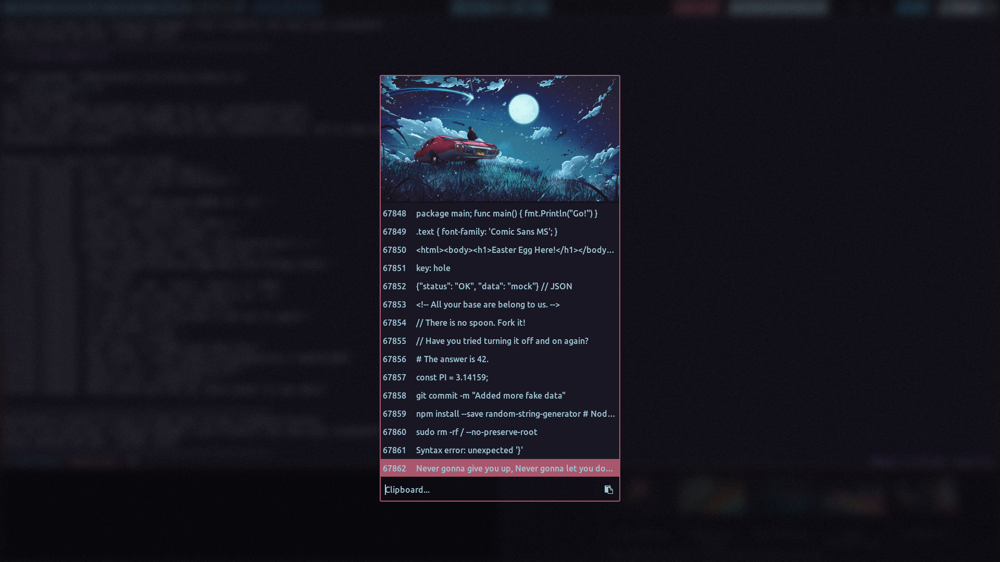
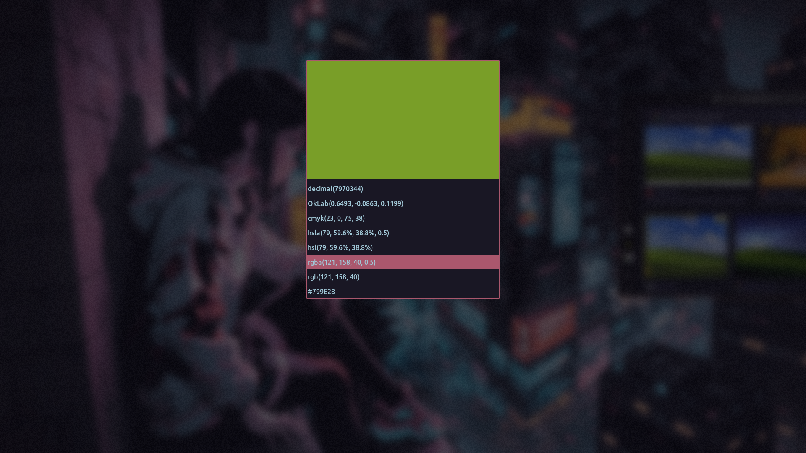
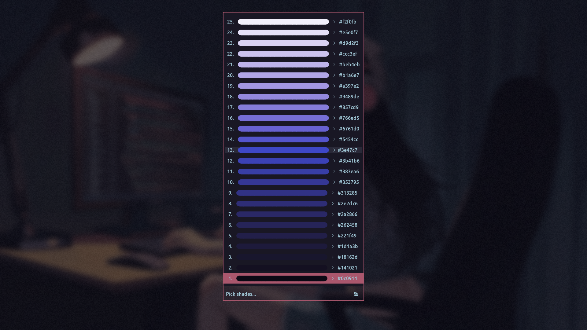
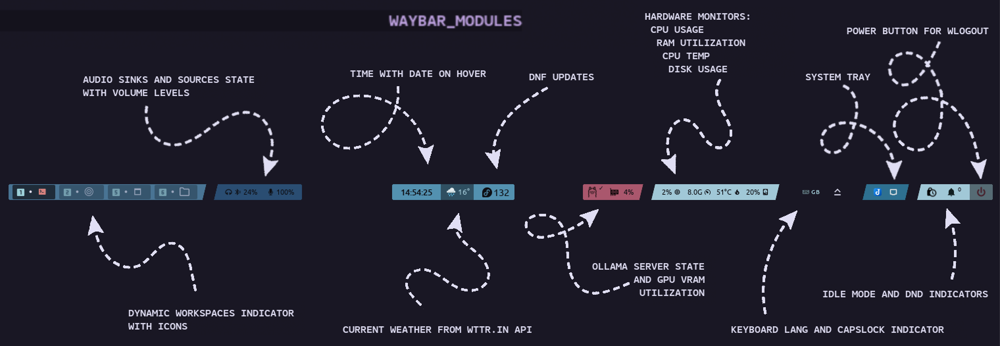
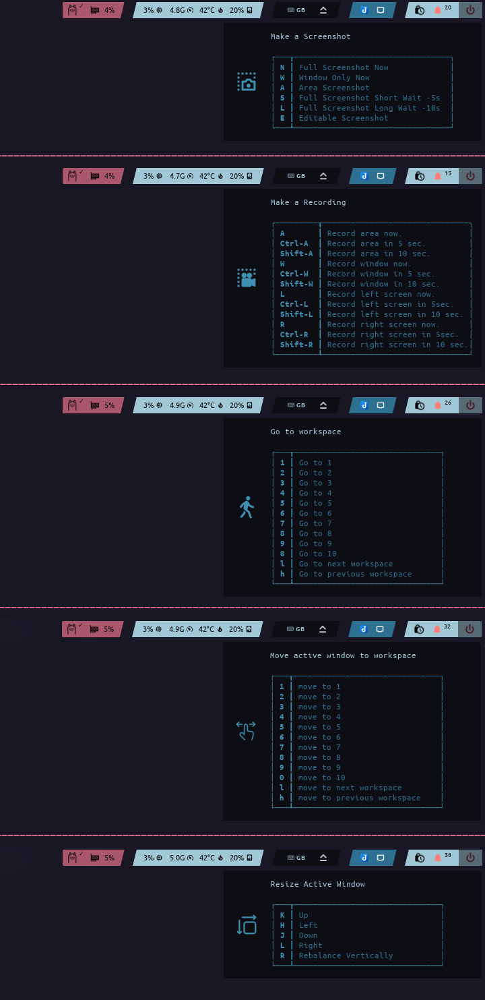

    

# My Hyprland Configuration 🚀

This is my custom configuration for Hyprland, a dynamic tiling Wayland compositor. This setup is designed to maximize productivity and streamline my workflow through powerful keybindings and custom scripts.

## Features and Integrations

#### A Collection of RosePine Color Adjusted Wallpapers

(Avalable here: [LINK](https://github.com/tom-gora/hypr-dots/tree/main/.config/hypr-wallpapers))

#### Rofi Scripts

This configuration includes several Rofi scripts that provide pickers for some quick access to various functionalities.

- **ClipManager&period;sh**: Rofi front for `cliphist` system clipboard manager to list previously copied items, enabling quick pasting of previously yanked content.  
   
  <small>\* Screenshot to present the custom vertical `rofi` composition with current wallpaper included, that I use a basic picker style.</small>

- **ColorPicker&period;sh**: A color picker to select color from the screen using `hyprpicker`. It provides various color formats (HEX, RGB, HSL, etc.) and allows to copy the selected color to the clipboard. Under the hood it uses `pastel` terminal color managament tool to convert to other color format strings and `imagemagick` to create temporary color-filled rectangle image that `rofi` uses to display picked color in the format selection part.
  

- **RofiShades&period;sh**: A script that generates a gradient of color shades based on a selected color using color from clipboard if present or launching a color picker first. It uses `pastel` to generate shades available at a keystroke.
  

- **QuickEdit&period;sh**: A Rofi menu for quick access to `hyprland` configuration files.

- **RofiBluetooth&period;sh**: A Bluetooth management script that uses `bluetoothctl` to connect and manage Bluetooth devices. Using: [LINK](https://github.com/nickclyde/rofi-bluetooth)

- **RofiEmoji&period;sh**: An emoji picker that allows to search and select emojis from a predefined list. The selected emoji is copied to the clipboard.

- **RofiSshHosts&period;sh**: An SSH host picker that allows to quickly connect to hosts defined in `~/.ssh/config`

- **Roxide&period;sh**: A script that integrates with `zoxide`, to quickly open a directory in a terminal.

- **TmuxSessions&period;sh**: A script that provides a menu for managing `tmux` sessions or create new one from `zoxide` input. It uses `sesh` as a dependency.

#### Custom Slanted-Style Waybar

(Config avalable here: [LINK](https://github.com/tom-gora/hypr-dots/tree/main/.config/waybar))

#### Styled Wlogout Menu with Lovely Subtle CSS Color Transition

(Config avalable here: [LINK](https://github.com/tom-gora/hypr-dots/tree/main/.config/wlogout))

https://github.com/user-attachments/assets/0521b06c-9c7d-46e4-94c8-f9eddcd83351

#### Hyprland and SNC Notification Deamon

Hyprland's submap feature (define a binding that acts as a leader for second layer of actions after additional keypress) work together with the help of `notify-send` and some bash glue code to use notifications to display hint popups for more complex actions (acting like which-key plugins from `neovim` or `vscode`) to provide further graphical hints and nice GUI experience.

---

## IMPORTANT

This is very much not a distribution or a comprehensive setup. There is no claim anything will work on a system other than mine. It started waaaaay back from JaKooLit's dots [LINK](https://github.com/JaKooLit/Fedora-Hyprland) as a base but significantly evolved away from this base. The aim was to make it look, feel, and work nice for me and learn about the environment as I strip away provided fluff. It is just my personal config that I maintain for myself, however, feel free to get inspired or grab code. Remember, I do not recommend trying to comprehensively apply any of the dots willy-nilly, as those are very much specific to my machine with my hardware, installed dependencies and preferences.

## License

This configuration is private and not intended for distribution. You are free to take anything you want, but there are no guarantees or support provided. This work is released into the public domain under the Unlicense. See the UNLICENSE file for details.
