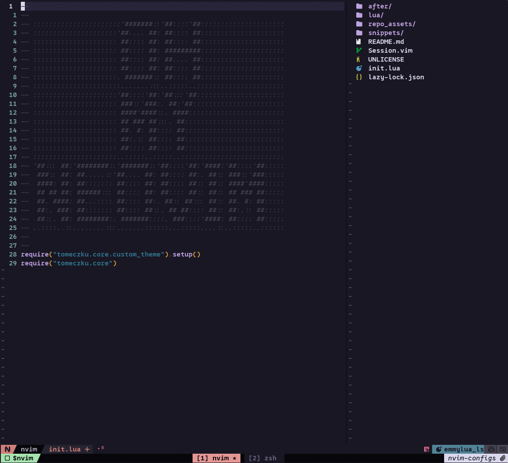
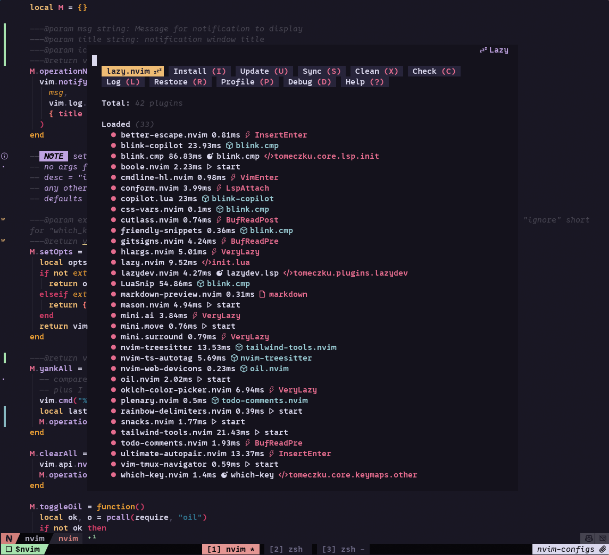
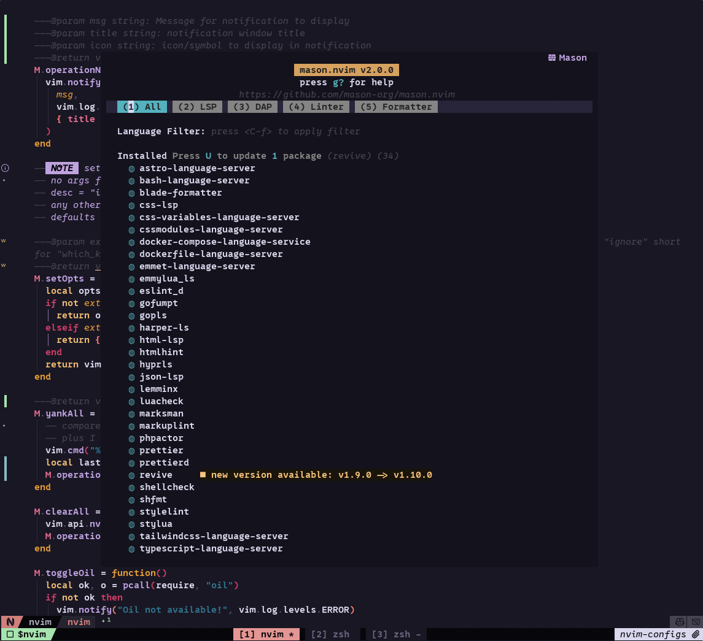
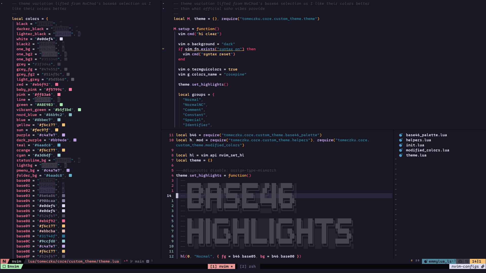
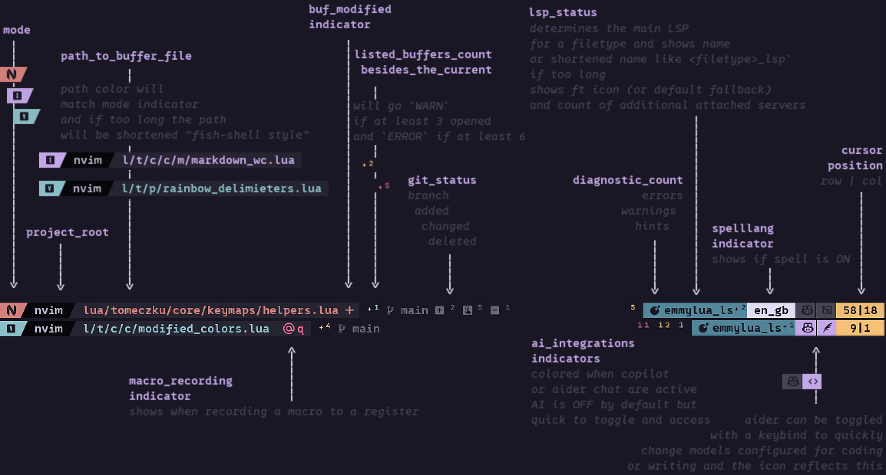
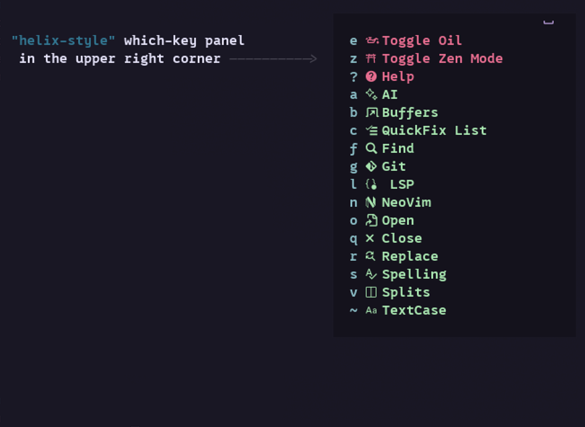
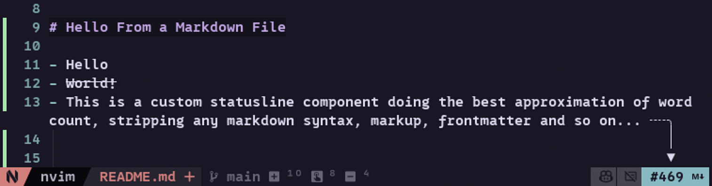

# My Neovim configuration

This is my private custom configuration for Neovim. No distros. Plenty of custom personal workflow enhancements. About 40 plugins and shrinking 💪💪💪

## Plugins

Plugins managed by `lazy.nvim` while native package manager is still only on the roadmap:

- #### nvim-aider
  Cursor for those living in terminal.
- #### blink.cmp
  And all its dependencies providing various sources (\* Snippets setup is currently in the works).
- #### friendly-snippets
- #### LuaSnip
- #### css-vars.nvim
- #### tailwind-tools.nvim
- #### blink-copilot
- #### copilot.lua   
- #### better-escape.nvim
  `jn` to trigger &lt;Esc&gt; because I don't want to remap CapsLock system-wide and accidentally doing Escape while gaming, `jj` and `jk` too easy to hit unwillingly while navigating and `jn` is just FREE REAL ESTATE!
- #### boole.nvim
  Simpler than dial plugin. Just enough functionality for my taste.
- #### cmdline-hl.nvim
  No need to bring in entire `noice` baggage to only have nice icon indicating usage of cmdline.
- #### conform.nvim
  Formatters
- #### cutlass.nvim
  Vim heresy. Cuts are cuts and deletions go to the black hole register.
- #### gitsigns.nvim
  Git in the signcolumn.
- #### hlargs.nvim
  Highlight function arguments to immediately see where they are used.
- #### lazy.nvim
  Lazy package manager until native solution is here.
- #### lazydev.nvim
  For lua modules completions.
- #### markdown-preview.nvim
- Using fork with fixes from `Knyffen/markdown-preview.nvim` that works unlike the original package
- #### mason.nvim
- Language utilities installer.
- #### mini&period;ai, mini.move, mini.surround, nvim-highlight-colors
  A couple of useful utils from the `mini` library.
- #### nvim-treesitter
  The one and only.
- #### nvim-ts-autotag
  More webdev fluff...
- #### oklch-color-picker.nvim
  Pretty colors all around! Finally a plugin for a dirty webdev mouse-user ;)
- #### nvim-web-devicons
  Nice icons from nerdfont.
- #### oil.nvim
- The only file manager you need. Configured to show as right-hand "sidebar" split.
- #### plenary.nvim
  Everything depends on plenary. At this point why is this not core?
- #### rainbow-delimiters.nvim
  Because I like them. Also I configure base highlights with bumped up saturation for the brackets.
- #### snacks.nvim
  All-in-one. Only parts used: `bigfile`, `indent`, `lazygit`, `notifier`, `quickfile`, `terminal` and `zen` modules.
- #### text-case.nvim
  For quick toggling of text case.
- #### todo-comments.nvim
  Special purpose comment highlighter.
- #### ultimate-autopair.nvim
  It's good but every day I wonder more and more, do I really need this?
- #### vim-tmux-navigator
  Tmux pane/splits navigation
- #### which-key.nvim
  It's which-key. What else to say?
- #### nvim-silicon
  Code snippet as pretty images.
- #### quicker.nvim
  Nice (And readable!) UI for quickfix list.
- #### trouble.nvim
  For handling diagnostic errors and so and such, lsp something blah blah blah...

## Custom Features and Modules

- **Custom Statusline Components:**
  
  - Custom styled components for important indicators, including dynamic path formatting (shortened or full based on window width) and LSP status display with icons and client names.
  - Markdown word count display with debouncing and stripping of non-text elements like HTML tags and code blocks.
- **Specific Keymap Configurations:**
  - Keymaps organized into modules for normal, visual, insert, normal+visual, and terminal modes.
  - Filetype-specific keymaps for Lua, Markdown, Laravel, help files, Trouble, and the quickfix list.
- **Native LSP Configurations:**
  - Direct LSP configurations for various language servers (Lua, Bash, Emmet, Astro, PHPactor, TailwindCSS, TypeScript, HTML, Gopls, YAML, CSS, Harper, Docker Compose) without relying on nvim-lspconfig abstractions or intermediary setup plugins. No wrappers, just plain `vim.lsp.config()` calls. Only `mason` is used as frontend to manage package installs and retrieve their metadata.
  - Native (no plugins) diagnostics setup with specific icons, virtual text formatting (including showing the count of diagnostics on a line).
  - Autocommands adjusting certain lsp behaviors.
- **Custom Theme Implementation:**
  - Theme adapted locally from base-46 implementation of `rose-pine`.
  - Programmatic calculation and modification of colors for various highlight groups based on a base palette (things like darkening, lightening, muting, and saturating retrieved colors).
- **Modular Configuration Structure:**
  - Configuration broken down into core modules (autocommands, statusline, theme, keymaps, lsp, vim_opts) and plugin configurations.
- **AI Integrations:**
  - Supermaven for free AI completions always disabled by default, with quick keymap to toggle on/off in case help is needed. Completes via blink and uses no traditional AI ghost text to minimize flickering and code "jumping around the buffer" 😉
  - Aider as terminal vibing assistant, with quick toggle keymap to switch between models more appropriate for coding and for text writing 🤓

## Installation

To install this Neovim configuration:

1.  Clone the repository:
2.  Take what you want. You are on your own 😉

## Screenshots

Screenshots showcasing the configuration's appearance and features will be added here.

- Custom Theme:
  
- Custom Statusline:
  
- Custom Keybindings built into mostly &lt;leader&gt; driven "submenus"  
  ( inspired by AstroNvim's system )
  
- Markdown Word Count:
  

## License

This configuration is private and not intended for distribution. You are free to take anything you want, but there are no guarantees or support provided. This work is released into the public domain under the Unlicense. See the UNLICENSE file for details.
